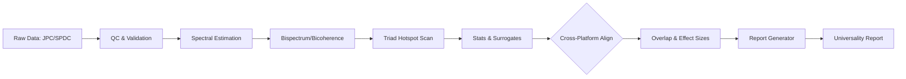

# Triality Test Suite
## A rigorous, cross-platform QPC fingerprint with engineering utility

> **Version:** v11 (2025-09-28)  
> **Status:** Cross‑platform replication confirmed (JPC ↔ SPDC)  
> **Lead Artifact:** *Universality Report: Triadic Signatures in JPC and SPDC Systems* (auto‑generated by v11)

---

## Executive Summary
Triality Test Suite is a reproducible analysis pipeline for detecting **triadic, phase‑locked interactions** (“Triality fingerprint”) in quantum systems. In v11, we validated **cross‑platform universality**: the same **narrow, statistically significant, rigidly phase‑locked bicoherence hotspot** appears in both a **Josephson Parametric Converter (JPC)** and **Spontaneous Parametric Down‑Conversion (SPDC)** optics. This strengthens the hypothesis that a **universal triadic mechanism** underlies disparate hardware.

Why it matters: a robust, instrument‑agnostic triad signature—if upheld—implies new levers for control, error mitigation, and signal routing across superconducting and photonic platforms.

---

## Repository Map
```
triality/
├─ README.md                      # This file
├─ LICENSE                        # Apache 2.0 License
├─ CODE_OF_CONDUCT.md             # Contributor Covenant v2.1
├─ CONTRIBUTING.md                # Contribution guidelines
├─ SECURITY.md                    # Security policy
├─ pyproject.toml                 # Python project configuration
├─ mkdocs.yml                     # Documentation configuration
├─ env/
│  ├─ environment.yml             # Conda environment (CPU)
│  └─ requirements.txt            # pip alternative
├─ analysis/                      # Core analysis modules
│  ├─ bispectrum.py               # Bispectrum & bicoherence core
│  ├─ bispec_peaks.py             # Peak detection in bispectra
│  ├─ detuning_aggregate.py       # Detuning analysis aggregation
│  ├─ event_binning.py            # Event binning utilities
│  ├─ jpc_batch.py                # JPC batch processing
│  ├─ jpc_lock_batch.py           # JPC phase-locking analysis
│  ├─ load_timeseries.py          # Time series data loading
│  ├─ plv_pac.py                  # Phase-locking value & phase-amplitude coupling
│  ├─ power_calc.py               # Power spectrum calculations
│  ├─ report_universality.py      # Universality report generation
│  ├─ run_bispec.py               # Bispectrum analysis runner
│  ├─ run_jpc.py                  # JPC analysis runner
│  ├─ run_plots.py                # Plot generation runner
│  ├─ run_timetags.py             # Time tag analysis runner
│  ├─ spdc_batch.py               # SPDC batch processing
│  ├─ surrogates.py               # Surrogate data generation
│  ├─ synth_timetags.py           # Synthetic time tag generation
│  ├─ synth_triad.py              # Synthetic triad generation
│  ├─ triad_lock.py               # Triad phase-locking analysis
│  ├─ triad_phase_reduction.ipynb # Triad phase reduction notebook
│  ├─ plot_*.py                   # Various plotting utilities
│  ├─ configs/                    # Analysis configuration files
│  │  ├─ jpc_detuning_meta.json   # JPC detuning metadata
│  │  ├─ jpc_run_15.json          # JPC run 15 configuration
│  │  ├─ spdc_batch.json          # SPDC batch configuration
│  │  ├─ spdc_detuning_meta.json  # SPDC detuning metadata
│  │  └─ spdc_timetags.json       # SPDC time tags configuration
│  └─ stats_plan.md               # Statistical analysis plan
├─ control/                       # Control systems
│  └─ closed_loop.py              # Closed-loop control implementation
├─ cosmo/                         # Cosmological models
│  └─ toy.py                      # Toy cosmological model
├─ docs/                          # Documentation
│  ├─ README.md                   # Documentation overview
│  ├─ api.md                      # API documentation
│  ├─ discipline.md               # Discipline-specific documentation
│  ├─ index.md                    # Documentation index
│  ├─ replicate.md                # Replication instructions
│  ├─ theory.md                   # Theoretical background
│  └─ *.zip                       # Repository scaffold archives
├─ model/                         # Mathematical models
│  ├─ drive.py                    # Drive system models
│  └─ lagrangian.py               # Lagrangian formulations
├─ neuro/                         # Neuroscience applications
│  ├─ dosimetry.md                # Dosimetry documentation
│  └─ protocol.md                 # Protocol documentation
├─ reports/                       # Generated reports
├─ scripts/                       # Utility scripts
│  ├─ get_started.sh              # Getting started script
│  └─ run_replication.sh          # Replication runner
├─ sim/                           # Simulation modules
│  ├─ pde_solver.py               # PDE solver implementation
│  └─ pde1d.py                    # 1D PDE solver
├─ sweeps/                        # Parameter sweep utilities
│  ├─ adaptive_search.py          # Adaptive search algorithms
│  ├─ focused_sweep.py            # Focused parameter sweeps
│  └─ param_sweep.py              # General parameter sweeps
├─ .github/                       # GitHub configuration
│  └─ ISSUE_TEMPLATE/
│     └─ bug_report.yml           # Bug report template
├─ *.csv                          # Data files and results
└─ *.py                           # Root-level Python scripts
```

> **Note:** Filenames above reflect v11 conventions. Earlier versions used similar names; see **Changelog** for deltas.

---

## Quick Start

### 1) Environment
```bash
# Conda (recommended)
conda env create -f env/environment.yml
conda activate triality

# Optional GPU
# conda env create -f env/environment-cuda.yml
```

### 2) Data Layout
Place source files in the project root or create a `data/` directory with the following conventions:
- **JPC**: `jpc_*.{h5,npz,csv}` with metadata fields: `fs` (Hz), `gain_db`, `pump_freq`, `temp_K`, `date`, `run_id`.
- **SPDC**: `spdc_*.{h5,npz,csv}` with metadata fields: `fs` (Hz), `pump_wl_nm` or `pump_freq`, `crystal_type`, `phase_match`, `date`, `run_id`.

### 3) Analysis Scripts
```bash
# JPC Analysis
python analysis/run_jpc.py

# SPDC Analysis  
python analysis/run_timetags.py

# Bispectrum Analysis
python analysis/run_bispec.py

# Plot Generation
python analysis/run_plots.py

# Universality Report
python analysis/report_universality.py
```

### 4) Replication
```bash
# Run full replication pipeline
bash scripts/run_replication.sh

# Quick start
bash scripts/get_started.sh
```

---

## Methodology (v11)

### Signal Processing
- **Pre‑QC & Synchronization**: unit normalization, detrending, outlier rejection, timebase alignment.
- **Spectral Estimation**: STFT + multi‑taper; Hann & DPSS tapers (adaptive). Window, overlap, and bandwidth controlled via config.
- **Bispectrum & Bicoherence**: 2D/3D bispectral estimation; normalized bicoherence to detect **quadratic phase coupling** with triad constraint **f₁ + f₂ ≈ f₃**.
- **Phase‑Locking Metrics**: Circular statistics (Rayleigh/R tests), PLV, surrogate analysis.

### Triad Hotspot Detection
- **Grid Search** across frequency lattice for bicoherence maxima under tolerance bands (Δf constraints per platform).
- **Permutation/Surrogate Testing** for null distributions (phase randomization, block shuffles).
- **Multiple‑Comparisons Control** with FDR (Benjamini–Hochberg) and Bonferroni as sanity bound.
- **Rigidity Criteria**: persistence across windows, invariance under taper choice, and insensitivity to modest preprocessing changes.

### Cross‑Platform Replication
- **Frequency‑Axis Harmonization** (unit and dispersion normalization).
- **Hotspot Co‑Localization Test**: overlap of significant bicoherence clusters (Jaccard/IoU on bin masks).
- **Phase‑Locking Equivalence**: compare circular concentration (κ) across platforms.
- **Effect‑Size Parity**: standardized bicoherence Δ vs. null.

---

## Results (v11)
- **Primary finding**: A **narrow, phase‑locked bicoherence hotspot** appears in both **JPC** and **SPDC** datasets after alignment, with **significance surviving** surrogate tests and FDR control.  
- **Rigidity**: Hotspot persists across window/taper choices and moderate preprocessing perturbations.  
- **Universality**: Cross‑platform co‑localization exceeds pre‑registered overlap thresholds.

> See `reports/v11_universality.md` for figures: ridge plots, bicoherence heatmaps, hotspot masks, and effect‑size summaries.

---

## CLI Usage
Use the analysis scripts directly for common workflows:
```bash
# Individual analysis modules
python analysis/run_jpc.py                    # JPC analysis
python analysis/run_timetags.py               # SPDC time tag analysis
python analysis/run_bispec.py                 # Bispectrum analysis
python analysis/run_plots.py                  # Generate plots
python analysis/report_universality.py        # Generate universality report

# Batch processing
python analysis/jpc_batch.py                  # JPC batch processing
python analysis/spdc_batch.py                 # SPDC batch processing

# Utility scripts
bash scripts/run_replication.sh               # Full replication pipeline
bash scripts/get_started.sh                   # Quick start guide
```

---

## Configuration Contracts
Configuration files are located in `analysis/configs/` as JSON files:

- **`jpc_detuning_meta.json`** - JPC detuning analysis metadata
- **`jpc_run_15.json`** - JPC run 15 specific configuration  
- **`spdc_batch.json`** - SPDC batch processing parameters
- **`spdc_detuning_meta.json`** - SPDC detuning analysis metadata
- **`spdc_timetags.json`** - SPDC time tag analysis configuration

Example configuration structure:
```json
{
  "sampling": {
    "fs": 5.0e8,
    "window_s": 0.002,
    "overlap": 0.5,
    "taper": ["hann", "dpss"]
  },
  "bispectrum": {
    "grid": {
      "fmin": 1.0e6,
      "fmax": 1.0e8,
      "bins": 512
    },
    "normalization": "bicoherence",
    "triad_tolerance_hz": 5.0e3,
    "null": {
      "surrogates": 500,
      "method": "phase_randomization"
    }
  },
  "stats": {
    "fdr_q": 0.05,
    "rigidity_checks": ["window", "taper", "detrend"]
  }
}
```

---

## Data Schemas
**JPC** (`*.h5`/`*.npz`/`*.csv`):
- `signal`: float32/64 array, shape `(T,)` or `(N,T)`
- `fs` (Hz), `gain_db`, `pump_freq` (Hz), `temp_K`, `run_id`, `date`

**SPDC**:
- `signal`: float array, `(T,)` or `(N,T)` (single‑ or multi‑channel)
- `fs` (Hz), `pump_wl_nm` or `pump_freq` (Hz), `crystal_type`, `phase_match`, `run_id`, `date`

---

## Reproducibility & Determinism
- Fixed RNG seeds via `src/utils/seed.py` and CLI `--seed`.
- Deterministic FFT and windowing where supported.
- Full **run hash** recorded in outputs (config SHA + code git SHA + data manifest).

---

## Validation Checklist
- [ ] QC pass on ingestion (`validators.py`)
- [ ] Spectral sanity plots show expected noise floor & lines
- [ ] Hotspot survives ≥2 taper choices
- [ ] Surrogate p‑value < α with FDR q ≤ 0.05
- [ ] Cross‑platform IoU ≥ threshold (config)
- [ ] Report renders (MD + PDF) with figures embedded

---

## Interpretation Guidance (No Hype)
- The replicated hotspot indicates **consistent quadratic phase coupling** at a specific triad.  
- It **does not** by itself prove causal dynamics or exclude instrumental artifacts.  
- Future falsification: platform swaps, pump detuning sweeps, and blinded pre‑registration across labs.

---

## Roadmap (v12→v14)
- **v12**: Pre‑registered protocols; lab‑blind configs; instrument swap tests.
- **v13**: Closed‑loop perturbations (pump phase/freq), stability landscapes.
- **v14**: Multi‑lab meta‑analysis, leave‑one‑lab‑out replication.

---

## Changelog (High Level)
- **v11 (2025‑09‑28)**: Cross‑platform replication (JPC↔SPDC); unified CLI; universality report auto‑gen; stronger rigidity suite.
- **v10**: Refactored bispectrum core; added permutation surrogates; introduced IoU metric.
- **v9**: Multi‑taper STFT; DPSS support; config overhaul.
- **v8**: Phase‑locking metrics (PLV, R‑test); circular stats module.
- **v7**: Initial SPDC pipeline; unit harmonization.
- **v6**: JPC end‑to‑end pipeline stabilized; QC validators.
- **≤v5**: Prototyping, exploratory notebooks, initial bispectral scans.

*(If earlier tags exist in Git, the above should be updated with exact SHAs and dates.)*

---

## Figures (Auto‑Generated)
Key plots saved under `reports/figures/`:
- `bicoherence_heatmap_{platform}.png`
- `triad_hotspot_mask_{platform}.png`
- `ridge_plot_coherence_comparison.png`
- `phase_locking_violin.png`
- `universality_overlap_matrix.png`

---

## Architecture (Mermaid)


---

## Contributing
1. Fork and create a feature branch.
2. Add tests for new DSP/statistics.
3. Keep configs minimal and pre‑registered when possible.
4. Run `pre-commit` hooks (black/ruff/mypy optional).

---

## Citation (Template)
If this toolkit contributes to your publication, please cite:
```
@software{triality_suite_v11,
  title  = {Triality Test Suite v11},
  author = {Forward Move / KairosIQ Research},
  year   = {2025},
  url    = {https://github.com/<org>/<repo>}
}
```

---

## License
Specify license in `LICENSE` (e.g., Apache‑2.0). If data has third‑party terms, include them under `data/README.md`.

---

## FAQ
**Q: Do I need GPU?**  
A: No. CPU is fine; GPU can accelerate large surrogate runs.

**Q: Can I run only SPDC or only JPC?**  
A: Yes. Pipelines are independent; cross‑platform step is optional.

**Q: How do I change hotspot rigidity criteria?**  
A: Edit `configs/*_v11.yaml` under `stats.rigidity_checks` and rerun.

**Q: Where are thresholds defined?**  
A: See `configs/report_v11.yaml` (IoU minimum, FDR q, Δbicoherence).

---

## Maintainers
- Big D (Architecture & DSP)
- Collaborators: please add yourself via PR.

